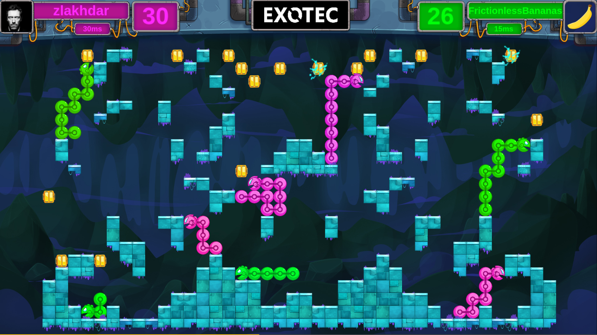
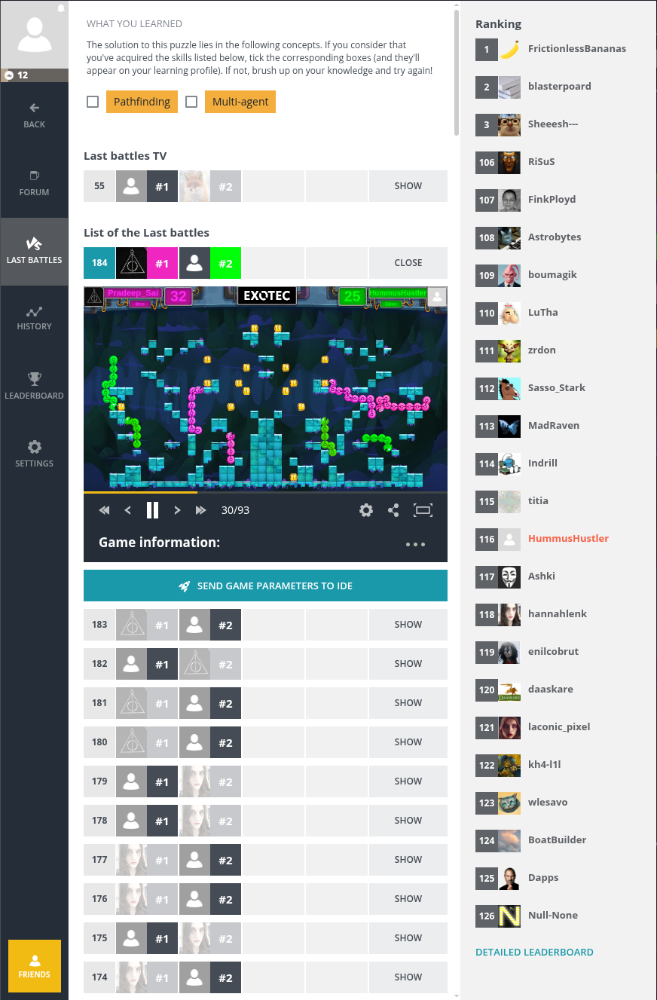
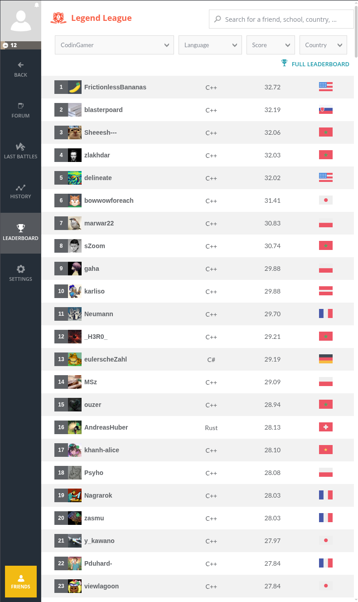
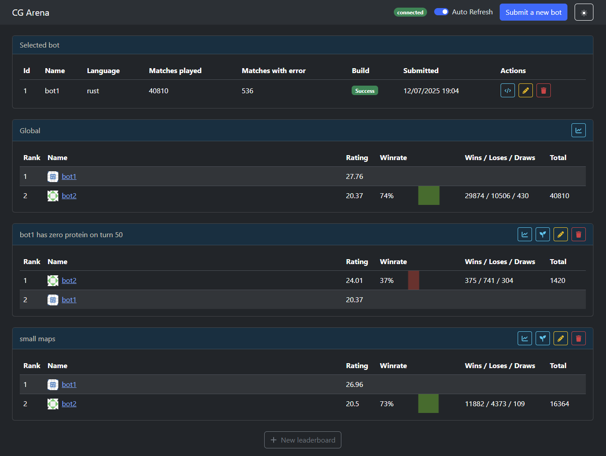

This post is a summary of my experience competing in the [CodinGame Winter 2026 competition](https://www.codingame.com/multiplayer/bot-programming/winter-challenge-2026-snakebyte). In this contest, competitors had to write a bot to play a game called "SnakeByte" against other entrants' bots. I finished 149th out of 2382 with a bot written in Rust.

<figure style="margin: 1.5rem auto; text-align: center;">
    
    <figcaption>A screenshot of a SnakeByte game.</figcaption>
</figure>

## SnakeByte

SnakeByte is a multiplayer programming game based on Snake, with a few twists to make it more interesting and better suited to a bot programming competition. Each match is played between two bot-controlled teams of four snakes on a 2D grid viewed from the side. Snakes grow by eating power sources, and the winner is the player with more total body segments remaining when the game ends.

One important mechanic is gravity. A snake needs at least one of its body segments to be supported by something solid, otherwise the whole snake falls. Platforms, other snakes, and uneaten power sources all count as support. Gravity makes it difficult for shorter snakes to climb high enough to reach power sources at the top of the map. However, because snakes can be supported by other snakes, it is possible to cooperate with allies, or even climb on opponents to get higher than would otherwise be possible.

<figure style="margin: 1.5rem auto; text-align: center;">
    <video controls muted alt="A gameplay clip showing SnakeByte snakes climbing, cooperating, and dying during a match." style="display: block; width: min(900px, 100%); margin: 0 auto;">
        <source src="./snakebyte-death-&-coop.webm" type="video/webm">
        Your browser does not support the video tag.
    </video>
    <figcaption>A video of a SnakeByte match, my bot "HummusHustler" is in green in this match.</figcaption>
</figure>

Each competitor submits source code to the platform. Bots are then continuously matched against each other, and the results determine each bot's position on the leaderboard. Each match lasts up to 200 turns. On each turn bots receives the game state via STDIN, they have 50ms to process the turn and write output commands to STDOUT. The turn output is simply the direction each snake under the bots control should move (up, down, left, right). After receiving output from both bots, the platform simulates both players' commands simultaneously and advances to the next turn. The game ends when all food has been eaten or when 200 turns have elapsed.

    <figure style="margin: 1.5rem 0; text-align: center; flex: 1 1 420px; max-width: 500px;">
        
        <figcaption style="width: 100%; margin: 0.5rem auto 0;">Last Battles view, where you can see replays of recent matches your bot has participated in.</figcaption>
    </figure>
    <figure style="margin: 1.5rem 0; text-align: center; flex: 1 1 420px; max-width: 500px;">
        
        <figcaption style="width: 100%; margin: 0.5rem auto 0;">The leaderboard.</figcaption>
    </figure>

You can read the full rules here: https://www.codingame.com/ide/puzzle/winter-challenge-2026-snakebyte

## Approach

My final entry used [beam search](https://en.wikipedia.org/wiki/Beam_search) to choose moves for each snake. I went through several iterations before settling on the final implementation.

### Initial Implementation

My very first implementation divided the 50ms turn time equally among all surviving snakes. Each snake performed a BFS that stopped as soon as it found reachable food, then moved along the discovered path. If no path to food was found before the time budget expired, the snake fell back to a simple heuristic that tried to avoid damage by avoiding moves likely to crash into a platform or another snake.

The BFS iteratively simulated all valid moves for each snake, including damage and gravity. Each snake had only three valid moves per turn, since moving backwards would always cause it to crash into itself, so the search had a branching factor of 3. Allied and opponent snakes were both treated as static obstacles.

The competition is split into leagues: bronze, silver, gold, and platinum. This approach was enough to reach gold league. The biggest weaknesses were:

1. The BFS only helped when it actually found food. If no food was found, the snake fell back to a very simple heuristic and often made poor moves. This happened both when food was only reachable by relying on other snakes to move into useful positions later, and when the search simply couldn't go deep enough to find a path because the food was too far away.
2. Each snake operated individually and they couldn't cooperate to reach food.

### Beam Search

I wanted my bot to make reasonable decisions even when it couldn't find food immediately, so I replaced the per-snake BFS with a per-snake beam search. Planning was still sequential: each controlled snake searched against a projected working state so later allies could avoid cells already claimed by earlier ones. There was still no true coordinated planning beyond the first move, and enemy snakes were still treated as static obstacles.

The search expanded states layer by layer for the allotted time, kept only the top scoring states at each depth, and then chose the root move corresponding to the best branch it had found. Each search node tracked the simulated body, the first root move, the search depth, and the cumulative length delta.

The evaluation function used for deciding which nodes to discard was:

`score = average_length_delta + distance_bonus`

`average_length_delta = cumulative_length_delta / depth`

Here `cumulative_length_delta` is the running total formed by adding the snake's current length delta at every simulated turn along the branch. That means an early gain or loss is counted again on each later turn, so earlier events have more weight than later ones. Dividing by depth then normalizes for branch length without removing that bias toward earlier, more reliable gains and losses. The `distance_bonus` was a bonus based on Manhattan distance to the nearest remaining food; the bonus decays linearly based on distance to the nearest food source.

I arrived at the cumulative length delta approach after noticing that snakes would sometimes ignore nearby food in favour of a longer, more efficient route to collect multiple pieces, only for an enemy snake to take the closer food first and invalidate the plan.

### Coordinated Beam Search

After analysing the per-snake beam search, I noticed that deeper searches were not especially beneficial. Presumably this was because the farther ahead the search looked, the less accurate the static-snake assumption became. That made me think it was better to spend simulation budget on coordination rather than on more depth, so I tried simulating all of my snakes together as a single entity.

I kept the beam search structure, but now each node represented a combined move for the whole team, for example `{snake1: up, snake2: down, snake3: up}`. In the worst case, this increased the branching factor to `3^4 = 81`: three legal moves for each of four snakes.

Initially this performed much worse. The larger branching factor forced me to give up either beam width or search depth. I made some optimisations to increase the number of simulations I could perform per turn, tweaked the evaluation function, and introduced adaptive beam width. The adaptive beam width helped maintain a more consistent search depth as the effective branch factor changed during the game, for example as snakes are eliminated.

Even with those improvements, I could never get this version of the bot to perform as well as the previous one.

### Adaptive Beam Search

The improvement that got me into platinum was going back to performing a beam search for individual snakes by default, while allowing nearby snakes that were likely to interact to be handled as a group. Snakes which were close together were combined into a pair were simulated together, otherwise snakes were simulated one at a time. After patitioning the snakes, we would have a set of groups, for example `[[Snake1, Snake2], [Snake3], [Snake4]]`. We would process each group one at a time, while treating opponents and snakes in other groups as static obstacles.

Snake partitioning was simple, iterate through each possible pair of snakes, if either the heads or tails are within 4 tiles (manhattan distance) of each other, greedily form a pair. Once a snake is paired, it cannot be paired again. If three snakes were close together, the partitiong would group them as 2 + 1 rather than trying to form a group of three.

This change recovered a lot of the lost search depth while still allowing coordinated play. Since groups were capped at size 2, the worst-case branching factor dropped from `3^4 = 81` in the full-team search to `3^2 + 3^2 = 18` when the turn decomposed into two paired searches. It was quite satisfying to watch pairs of snakes cooperate to climb toward food in situations where the earlier bots would fail. 

<figure style="margin: 1.5rem auto; text-align: center;">
    <video controls muted alt="A gameplay clip showing two allied snakes coordinating to climb toward food." style="display: block; width: min(900px, 100%); margin: 0 auto;">
        <source src="./example-game.webm" type="video/webm">
        Your browser does not support the video tag.
    </video>
    <figcaption>My two green snakes cooperating from about 4s onwards.</figcaption>
</figure>

Most of the remaining work was tuning the various bot parameters: the weights for the evaluation function, and the beam search width. I eventually settled on the same general adaptive beam-width concept as before, but tracked it separately for groups of size 1 and 2 so each could converge toward a more appropriate search depth.

One weakness of my final bot was that it did not account for possible enemy moves. That sometimes caused snakes to get trapped and lose a lot of segments in avoidable ways.

<figure style="margin: 1.5rem auto; text-align: center;">
    <video controls muted alt="A gameplay clip showing one of my snakes getting trapped and losing avoidable segments." style="display: block; width: min(900px, 100%); margin: 0 auto;">
        <source src="./trapped-1.webm" type="video/webm">
        Your browser does not support the video tag.
    </video>
    <figcaption>My pink snake gets cornered and destroyed on the bottom left.</figcaption>
</figure>

<figure style="margin: 1.5rem auto; text-align: center;">
    <video controls muted alt="A gameplay clip showing another case where my snakes get trapped and take avoidable damage." style="display: block; width: min(900px, 100%); margin: 0 auto;">
        <source src="./trapped-2.webm" type="video/webm">
        Your browser does not support the video tag.
    </video>
    <figcaption>At 7s my green snake gets trapped and destroyed in the upper center.</figcaption>
</figure>

Another weakness was that snakes would sometimes get stuck in a local maximum, hovering in one area because moving away would temporarily worsen the evaluation function.

<figure style="margin: 1.5rem auto; text-align: center;">
    <video controls muted alt="A gameplay clip showing my snakes stuck in a local maximum and hesitating to move away." style="display: block; width: min(900px, 100%); margin: 0 auto;">
        <source src="./local-minima-1.webm" type="video/webm">
        Your browser does not support the video tag.
    </video>
    <figcaption>My green snake gets stuck in a local maximum in the center of the map. Once the enemy eats the food it was aiming for, the deadlock breaks and the snake finally finds something useful to do instead.</figcaption>
</figure>

Finally, my bots would sometimes hesitate to pick up food. I think this happened when multiple snakes were near the same target: the evaluation gain from actually eating the food was outweighed by the food-proximity bonus that several snakes would lose afterward. I thought I had tuned the evaluation function to avoid this, but apparently not 🤷.

<figure style="margin: 1.5rem auto; text-align: center;">
    <video controls muted alt="A gameplay clip showing my snakes hesitating to pick up nearby food." style="display: block; width: min(900px, 100%); margin: 0 auto;">
        <source src="./food-hesitancy.webm" type="video/webm">
        Your browser does not support the video tag.
    </video>
    <figcaption>My two green snakes hesitate to take the food on the upper right corner.</figcaption>
</figure>

## Workflow

The biggest workflow improvement compared to previous competitions was local testing with [cgarena](https://github.com/aangairbender/cgarena). This let me run different versions of my bot against each other, which was especially useful for parameter tuning.

<figure style="margin: 1.5rem auto; text-align: center;">
    
    <figcaption><code>cgarena</code> made it easy to run different versions of my bot against each other locally.</figcaption>
</figure>

I used [CG-Bundler](https://github.com/MathieuSoysal/cg-bundler) to keep the Rust code split across multiple files while still producing a single-file submission for CodinGame.

## Conclusion

This was my first CodinGame contest using a simulation-based approach, and I was surprised by how effective even the very simple BFS-based version was. In future competitions, I would like to experiment with MCTS and related techniques so my bots can factor in potential opponent moves.
